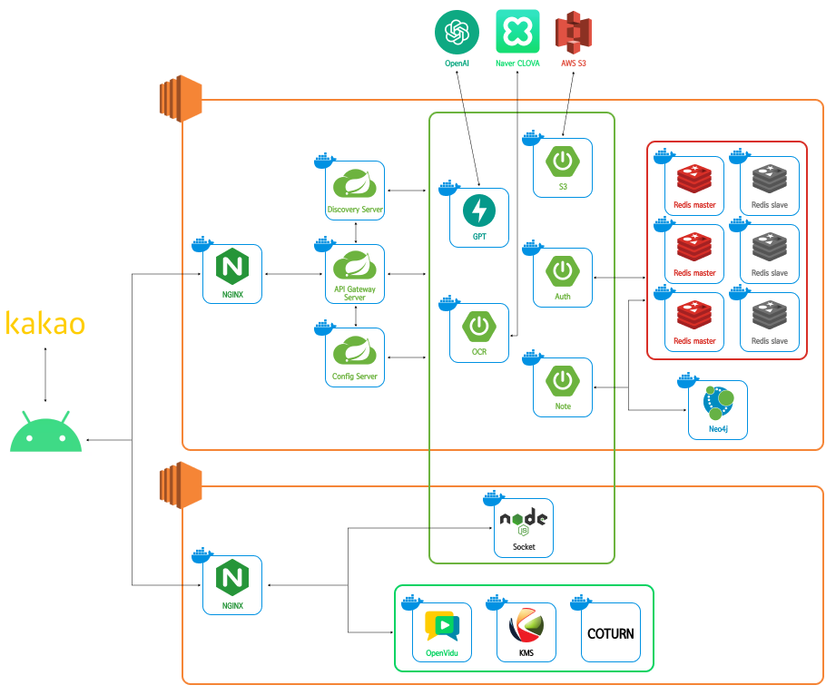

# 📝 S-Tab

###  <strong>실시간 그룹 음성 통화와 데이터 공유가 가능한 태블릿 필기 어플리케이션

 

# 📚 목차

1. [개요](#📘-개요)
2. [기술 스택](#🔧-기술-스택)
3. [설계](#✏-설계)
4. [서비스 및 기능 소개](#📖-서비스-및-기능-소개)
5. [팀원 소개](#👨‍👨‍👧👨‍👧‍👦-팀원-소개)

  

# 📘 개요

> **💻프로젝트 기간** : 2024.04.08 (월) ~ 2024.05.20 (월)   **서비스 URI** : [S-Tab APK 다운로드](https://s-tab.online/)   **참고 영상** : [UCC]()

 

# 🔧 기술 스택
||이슈관리|형상관리|코드리뷰|커뮤니케이션|디자인|
|---|------|---|---|---|---|
|TOOL||||||

## 💻 IDE

 

## 🛢 Back-End

 

### 📱 Front-End

 

### 🌐 Server

  

# ✏ 설계
### - 아키텍처

  
### - ERD
![ERD]](./docs/assets/architecture.png)

### - 와이어프레임
![ERD]](./docs/assets/architecture.png)

# 서비스 및 기능 소개 
|  | 
| :---------------------: | 
| **Landing Page** |
| 소셜 로그인을 지원합니다. | 

  

### 개인 스페이스 
|  |  |
| :-----------------------------: | :------------------------------: |
| **Step 1 & Step 2** | **Step 3-1** |
| 설명 | 설명 |
|  |  |
| **Step 3-2** | **Step 3-3** |
| 설명 |설명|

  

### 공유 스페이스 
|  |  |
| :-----------------------------: | :------------------------------: |
| **Step 1 & Step 2** | **Step 3-1** |
| 설명 | 설명 |
|  |  |
| **Step 3-2** | **Step 3-3** |
| 설명 |설명|

  

### 편의기능 
|  |  |
| :-----------------------------: | :------------------------------: |
| **Step 1 & Step 2** | **Step 3-1** |
| 설명 | 설명 |
|  |  |
| **Step 3-2** | **Step 3-3** |
| 설명 |설명|

  

# 👨‍👨‍👧👨‍👧‍👦 팀원 소개

