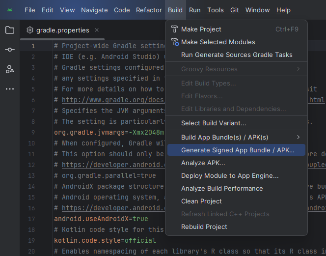
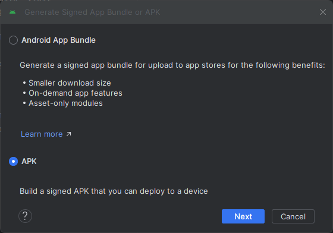
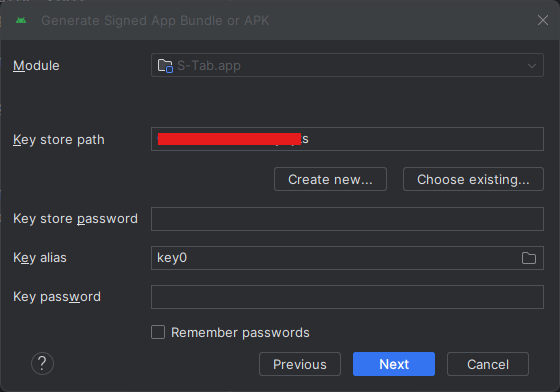
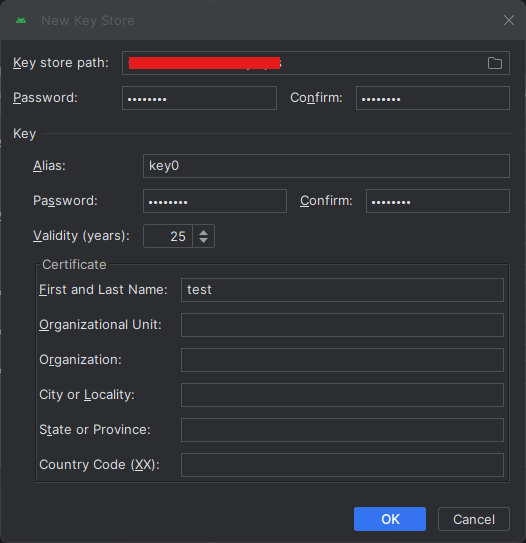

# S-Tab 포팅 매뉴얼

## 목차

1. [환경 설정](#1-환경-설정)

- [기술 스택](#기술-스택)
- [외부 서비스](#외부-서비스)

2. [빌드 및 배포](#2-빌드-및-배포)

- [환경 변수 설정](#환경-변수-설정)
- [빌드 및 배포](#빌드-및-배포)

## 1. 환경 설정

### 기술 스택

- 이슈 관리: Jira
- 형상 관리: Gitlab
- 코드 리뷰: Gerrit
- 커뮤니케이션: Mattermost, Notion, Discord
- 디자인: Figma
- 개발 환경
  - IDE
    - Android Studio Iguana 2023.2.1 Patch 1
    - IntelliJ IDEA 2024.1.1 (Community Edition)
    - Visual Studio Code 1.85.1
  - Server
    - AWS EC2 (2 EA)
      - Ubuntu 20.04.6 LTS
      - Docker 26.1.0
      - Nginx 1.18.0
      - OpenSSL 1.1.1f
    - AWS S3 Bucket
  - Front-End
    - Kotlin 1.5.1
    - Java 17 (OpenJDK 17.0.9)
    - Android 14.0 (UpsideDownCake)
    - Kakao SDK 2.20.1
    - WebRTC SDK for Android 114.5735.10
    - Websocket Client 2.9
  - Back-End
    - Java 17 (Azul Zulu version 17.0.9)
    - Spring Boot 3.2.5
    - Spring Cloud 2023.0.1
    - Neo4j 5.19.0
    - Redis 6.2.3 (6 Nodes Cluster)
    - Node.js 20.12.2
    - Socket.io 4.7.5
    - Python 3.9.19
    - FastAPI 0.111.0
    - Langchain 0.1.17
    - OpenVidu Server 2.29.0
    - Kurento Media Server 7.0.1

### 외부 서비스

- Kakao OAuth: [Kakao developers](https://developers.kakao.com/)
- AWS S3 Bucket: [AWS S3](https://s3.console.aws.amazon.com/)
- OpenAI: [OpenAI API](https://openai.com/index/openai-api/)
- Naver Cloud: [CLOVA OCR](https://clova.ai/ocr/)
- OpenVidu: [OpenVidu](https://openvidu.io/)

## 2. 빌드 및 배포

### 환경 변수 설정

- `./frontend/local.properties`

  ```properties
  sdk.dir={SDK_DIRECTORY}
  kakao_native_app_key={KAKAO_NATIVE_APP_KEY}
  openvidu_server={OPENVIDU_SERVER_URL}
  openvidu_secret=OPENVIDUAPP:{OPENVIDU_SECRET}
  socket_server={SOCKET_SERVER_URL}
  base_url={SPRING_CLOUD_API_GATEWAY_URL}
  base_s3={AWS_S3_BUCKET_BASE_URL}
  ```

- `./eureka`, `./config`, `./gateway`, `./note`, `./auth`, `./s3`, `./ocr`

  - 각 프로젝트의 `./src/main/resources/application.yml` 파일에 필요한 부분 채워 넣음

- Config Server Git: `gateway-prod.yml`

  ```yml
  spring:
    data:
      redis:
        cluster:
          max-redirects: 3
          password: {REDIS_PASSWORD}
          nodes:
            - redis-1:6379
            - redis-2:6380
            - redis-3:6381
            - redis-4:6382
            - redis-5:6383
            - redis-6:6384

  jwt:
    token:
      secret-key: {JWT_SECRET_KEY}
  ```

- Config Server Git: `note-prod.yml`

  ```yml
  spring:
    data:
      neo4j:
        uri: neo4j://neo4j:7687
        username: {NEO4J_USERNAME}
        password: {NEO4J_PASSWORD}
      redis:
        cluster:
          max-redirects: 3
          password: {REDIS_PASSWORD}
          nodes:
            - redis-1:6379
            - redis-2:6380
            - redis-3:6381
            - redis-4:6382
            - redis-5:6383
            - redis-6:6384
  ```

- Config Server Git: `auth-prod.yml`

  ```yml
  spring:
      data:
        redis:
          cluster:
            max-redirects: 3
            password: {REDIS_PASSWORD}
            nodes:
              - redis-1:6379
              - redis-2:6380
              - redis-3:6381
              - redis-4:6382
              - redis-5:6383
              - redis-6:6384

    jwt:
      token:
        secret-key: {JWT_SECRET_KEY}
      access-token:
        expire-length: 1800000
      refresh-token:
        expire-length: 1209600000
  ```

- Config Server Git: `s3-prod.yml`

  ```yml
  cloud:
    aws:
      s3:
        bucket: {BUCKET_NAME}
      stack:
        auto: false
      region:
        static: {BUCKET_REGION}
      credentials:
        access-key: {IAM_ACCESS_KEY}
        secret-key: {IAM_SECRET_KEY}
  ```

- Config Server Git: `ocr-prod.yml`

  ```yml
  feign:
    naver-cloud:
      clova-ocr-api:
        secret-key: {NAVER_CLOVA_OCR_API_KEY}
        url: {NAVER_CLOUD_API_GATEWAY_OCR_URL}
        path: {NAVER_CLOUD_API_GATEWAY_OCR_PATH}
  ```

- `./gpt/.env`

  ```properties
  OPENAI_API_KEY={OPENAI_API_KEY}
  EUREKA_SERVER_URL={EUREKA_SERVER_URL}
  ```

- `./socket/.env`

  ```properties
  EUREKA_SERVICE_URL={EUREKA_SERVER_URL}
  IP_ADDR={EC2_PUBLIC_IP}
  HOST_NAME={EC2_HOST_NAME}
  VIP_ADDR={SERVER_VIRTUAL_IP}
  port={SERVER_PORT}
  ```

### 빌드 및 배포

- `./frontend`

  - Android Studio의 `Build > Generate Signed App Bundle / APK...` 메뉴 선택<br/>
    <br/>

  - `APK` 선택 후 `Next` 버튼 클릭<br/>
    <br/>

  - `Create new...` 버튼 클릭하여 `Key store` 생성<br/>
    <br/>

  - `Key store path`, `Password`, `Confirm`, `First and Last Name` 입력 후 `OK` 버튼 클릭, `Next` 버튼 클릭<br/>
    <br/>

  - `release` 선택 후 `Finish` 버튼 클릭<br/>
    <br/>

  - Key store path에 생성된 key의 hash 값 생성

    ```bash
    keytool -exportcert -alias <RELEASE_KEY_ALIAS> -keystore <RELEASE_KEY_PATH> | openssl sha1 -binary | openssl base64
    ```

  - 생성된 Key hash 값 Kakao developers에 등록

  - `./app/release` 폴더 내 생성된 APK 파일 실행

- EC2-1

  - NGINX

    - `docker-compose.yml`

      ```yml
      services:
        nginx:
          container_name: nginx
          image: nginx:latest
          restart: unless-stopped
          volumes:
            - ./ssl:/etc/ssl
            - ./conf/nginx.conf:/etc/nginx/conf.d/default.conf
            - ./index:/var/www/html
          networks:
            - nginx-network
          ports:
            - 80:80
            - 443:443

      networks:
        nginx-network:
          name: nginx-network
          driver: bridge
      ```

    - `./conf/nginx.conf`

      ```nginx
      server {
          listen 80;
          server_name <SERVER_NAME>;
          return 301 https://$host$request_uri;
      }

      server {
          listen 443 ssl;
          server_name <SERVER_NAME>;

          ssl_certificate /etc/ssl/certificate.crt;
          ssl_certificate_key /etc/ssl/private.key;

          location / {
              root /var/www/html;
              index index.html index.htm;
          }

          location /api {
              proxy_pass http://gateway:8000;
              proxy_set_header    Host                $host;
              proxy_set_header    X-Real-IP           $remote_addr;
              proxy_set_header    X-Forwarded-For     $proxy_add_x_forwarded_for;
              proxy_set_header    X-Forwarded-Proto   $scheme;
              proxy_set_header    Connection          '';
              proxy_http_version  1.1;
          }
      }
      ```

    - `./ssl` 폴더에 SSL 인증서 저장, `./index` 폴더에 서버 static 파일 저장

    - 이후
      ```bash
      sudo docker compose up -d
      ```

  - Redis cluster

    - `docker-compose.yml`

      ```yml
      services:
        redis-1:
          container_name: redis-1
          image: redis:6.2.3
          command: >
            redis-server --appendonly yes
            --cluster-enabled yes
            --cluster-config-file nodes.conf
            --cluster-node-timeout 5000
            --port 6379
            --requirepass {PASSWORD}
          ports:
            - 6379:6379
            - 16379:16379
          networks:
            - db-network

        redis-2:
          container_name: redis-2
          image: redis:6.2.3
          command: >
            redis-server --appendonly yes
            --cluster-enabled yes
            --cluster-config-file nodes.conf
            --cluster-node-timeout 5000
            --port 6380
            --requirepass {PASSWORD}
          ports:
            - 6380:6380
            - 16380:16380
          networks:
            - db-network

        redis-3:
          container_name: redis-3
          image: redis:6.2.3
          command: >
            redis-server --appendonly yes
            --cluster-enabled yes
            --cluster-config-file nodes.conf
            --cluster-node-timeout 5000
            --port 6381
            --requirepass {PASSWORD}
          ports:
            - 6381:6381
            - 16381:16381
          networks:
            - db-network

        redis-4:
          container_name: redis-4
          image: redis:6.2.3
          command: >
            redis-server --appendonly yes
            --cluster-enabled yes
            --cluster-config-file nodes.conf
            --cluster-node-timeout 5000
            --port 6382
            --requirepass {PASSWORD}
            --masterauth {PASSWORD}
          ports:
            - 6382:6382
            - 16382:16382
          networks:
            - db-network

        redis-5:
          container_name: redis-5
          image: redis:6.2.3
          command: >
            redis-server --appendonly yes
            --cluster-enabled yes
            --cluster-config-file nodes.conf
            --cluster-node-timeout 5000
            --port 6383
            --requirepass {PASSWORD}
            --masterauth {PASSWORD}
          ports:
            - 6383:6383
            - 16383:16383
          networks:
            - db-network

        redis-6:
          container_name: redis-6
          image: redis:6.2.3
          command: >
            redis-server --appendonly yes
            --cluster-enabled yes
            --cluster-config-file nodes.conf
            --cluster-node-timeout 5000
            --port 6384
            --requirepass {PASSWORD}
            --masterauth {PASSWORD}
          ports:
            - 6384:6384
            - 16384:16384
          networks:
            - db-network

      networks:
        db-network:
          name: db-network
          driver: bridge
      ```

    - 이후

      ```bash
      sudo docker compose up -d

      sudo docker exec -it redis-1 bash

      redis-cli -a <PASSWORD> --cluster create <SERVER_IP>:6379 <SERVER_IP>:6380 <SERVER_IP>:6381 <SERVER_IP>:6382 <SERVER_IP>:6383 <SERVER_IP>:6384 --cluster-replicas 1

      exit
      ```

  - Neo4j

    ```bash
    sudo docker run --name neo4j -d -p 7474:7474 -p 7473:7473 -p 7687:7687 --net db-network -v ./neo4j/data:/data -v ./neo4j/logs:/logs --env NEO4J_AUTH=neo4j/<PASSWORD> neo4j:latest
    ```

  - `./eureka`

    ```bash
    chmod +x ./gradlew

    ./gradlew clean build -x test

    sudo docker build -t eureka .

    sudo docker run -it -d -p 8761:8761 --net msa-network --name eureka eureka
    ```

  - `./config`

    ```bash
    chmod +x ./gradlew

    ./gradlew clean build -x test

    sudo docker build -t config .

    sudo docker run -it -d -p 8888:8888 --net msa-network --name config config
    ```

  - `./gateway`

    ```bash
    chmod +x ./gradlew

    ./gradlew clean build -x test

    sudo docker build -t gateway .

    sudo docker run -it -d -p 8000:8000 --net msa-network --net db-network --net nginx-network --name gateway gateway
    ```

  - `./note`

    ```bash
    chmod +x ./gradlew

    ./gradlew clean build -x test

    sudo docker build -t note .

    sudo docker run -it -d -p 8001:8001 --net msa-network --net db-network --name note note
    ```

  - `./auth`

    ```bash
    chmod +x ./gradlew

    ./gradlew clean build -x test

    sudo docker build -t auth .

    sudo docker run -it -d -p 8002:8002 --net msa-network --net db-network --name auth auth
    ```

  - `./s3`

    ```bash
    chmod +x ./gradlew

    ./gradlew clean build -x test

    sudo docker build -t s3 .

    sudo docker run -it -d -p 8004:8004 --net msa-network --name s3 s3
    ```

  - `./ocr`

    ```bash
    chmod +x ./gradlew

    ./gradlew clean build -x test

    sudo docker build -t s3 .

    sudo docker run -it -d -p 8005:8005 --net msa-network --name ocr ocr
    ```

  - `./gpt`

    ```bash
    sudo docker build -t gpt .

    sudo docker run -it -d -p 8003:8003 --net msa-network --name gpt gpt
    ```

- EC2-2

  - OpenVidu Server

    - [OpenVidu DOCS](https://docs.openvidu.io/en/2.29.0/deployment/ce/on-premises/)
    - `./openvidu start` 전 `./docker-compose.override.yml` 삭제

  - `./socket`

    ```bash
    sudo docker build -t socket .

    sudo docker run -it -d -p 5442:5442 --net host --name socket socket
    ```
